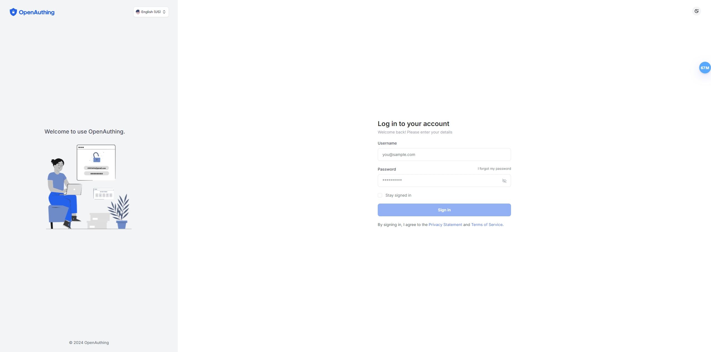

<h1 align="center">
  OpenAuthing
  <br>
</h1>
<h4 align="center">
  ✨ 开源身份云平台
</h4>

<p align="center">
    <a href="https://github.com/BeniceSoft/OpenAuthing">
        
    </a>
    
    
    
</p>
<p align="center">
    
    
    
</p>

<p align="center">
  <a href="#key-features">关键特性</a> •
  <a href="#how-to-use">如何使用</a> •
  <a href="#license">License</a>
</p>




## Demo

访问[体验地址](https://110.41.18.47:8443/)开始体验
> 用户名：`admin` 密码：`123abc!`

## ✨ 关键特性

* [**SSO**](./src/BeniceSoft.OpenAuthing.SSO/README.md)
* **动态外部身份源**
* **MFA**
* **数据权限**
* **组织管理**
* **用户&角色**
* **现代UI**

## 🔧 如何使用

To clone and run this application, you'll need [Git](https://git-scm.com)、[.NET](https://dot.net) and [Node.js](https://nodejs.org/en/download/)
(which comes
with [npm](http://npmjs.com)) installed on your computer. From your command line:

```bash
# Clone this repository
$ git clone https://github.com/BeniceSoft/OpenAuthing --recursive
```

### 初始化数据库

执行 [建表脚本](./scripts/1初始化建表.sql)、[初始化数据脚本呢](./scripts/2初始化数据.sql)

### 运行

在项目根目录下打开终端

```bash
# Go into the repository
$ cd OpenAuthing

# Install packages
$ dotnet restore

# Start AdminUI
$ cd AdminUI

# Install dependencies
$ npm install

# Run the app
$ npm start
```

> **Note**
> If you're using Linux Bash for
> Windows, [see this guide](https://www.howtogeek.com/261575/how-to-run-graphical-linux-desktop-applications-from-windows-10s-bash-shell/) or
> use `node`
> from the command prompt.

## 🪪 License

Apache-2.0

---

