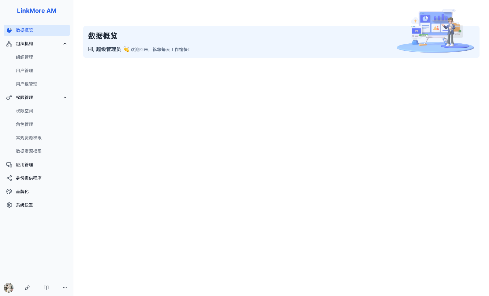
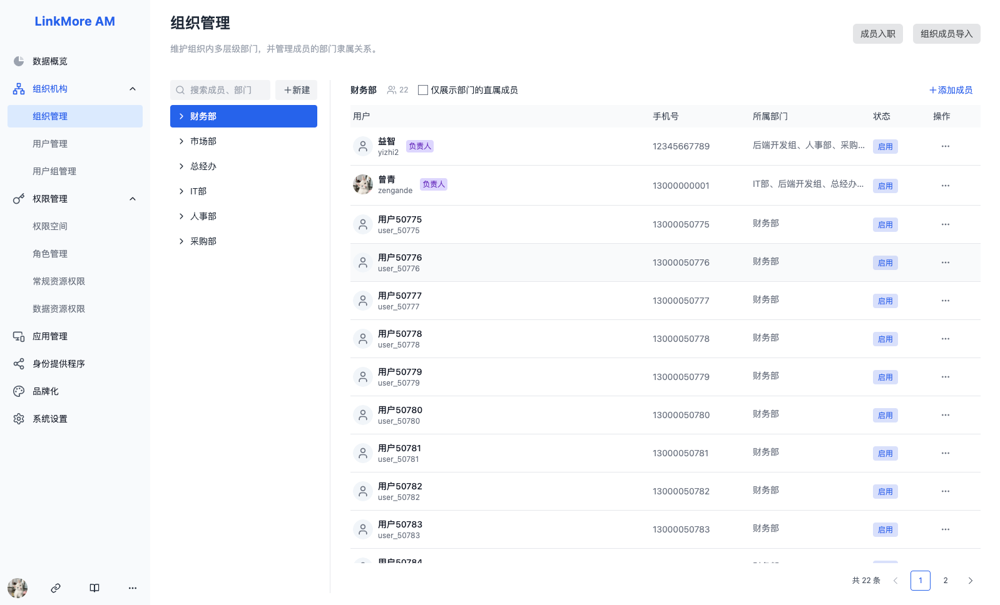
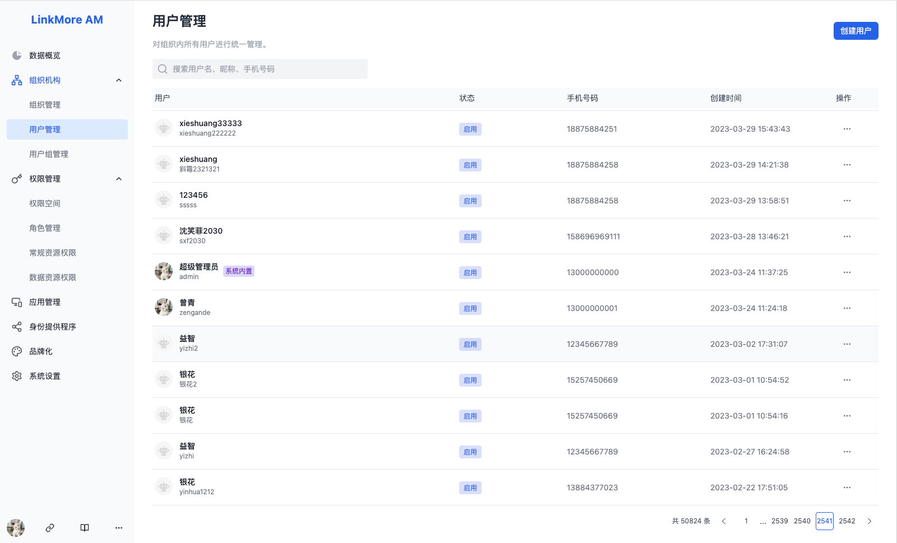
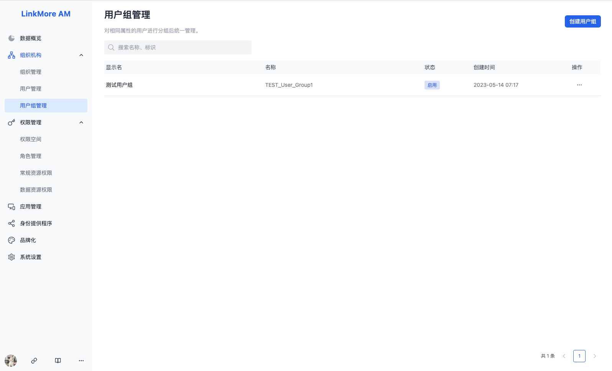
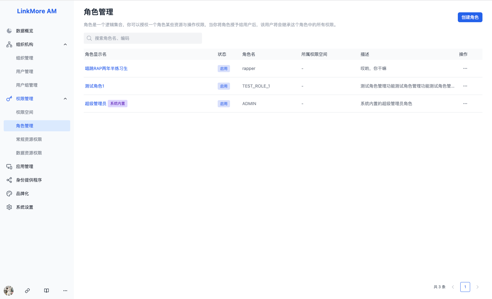
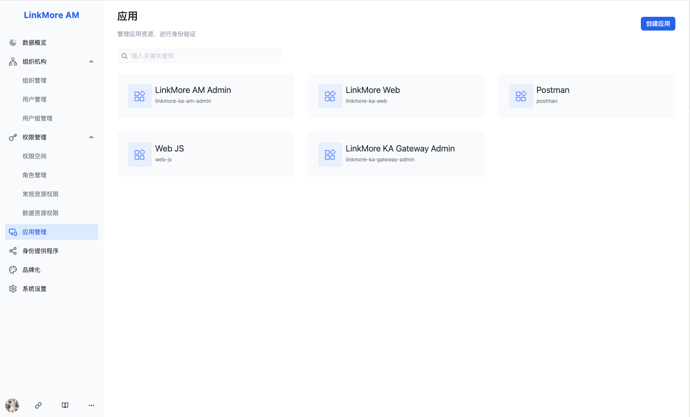
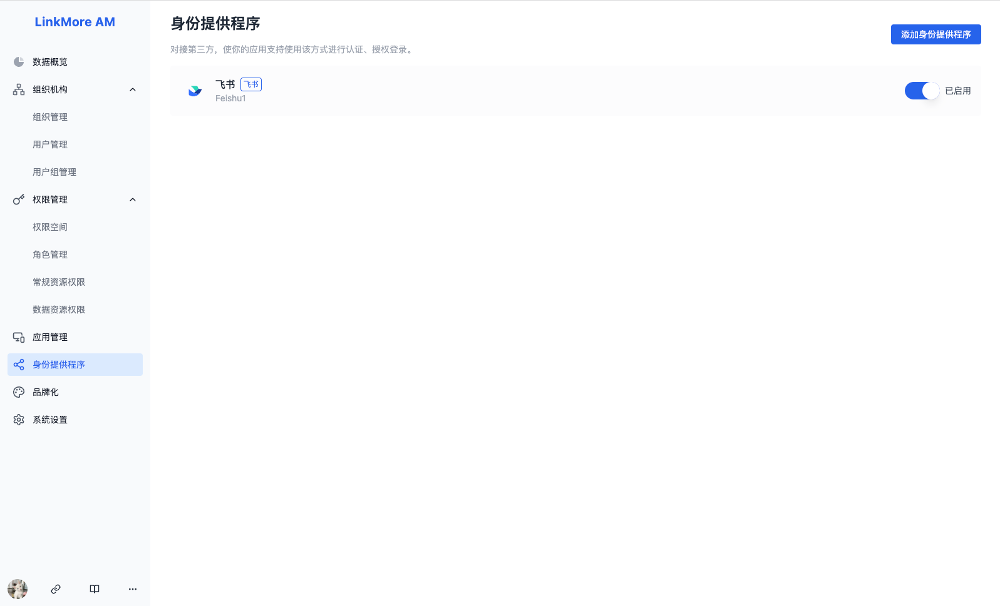

# LinkMore AM AdminUI

## 开发者
1. Install
``` bash
npm install
```

2. Start dev server
``` bash
npm start
```

3. Build
``` bash
npm run build
```

## 截图

* 数据概览


* 组织管理


* 用户管理


* 用户组管理


* 角色管理


* 应用管理


* 身份提供程序
